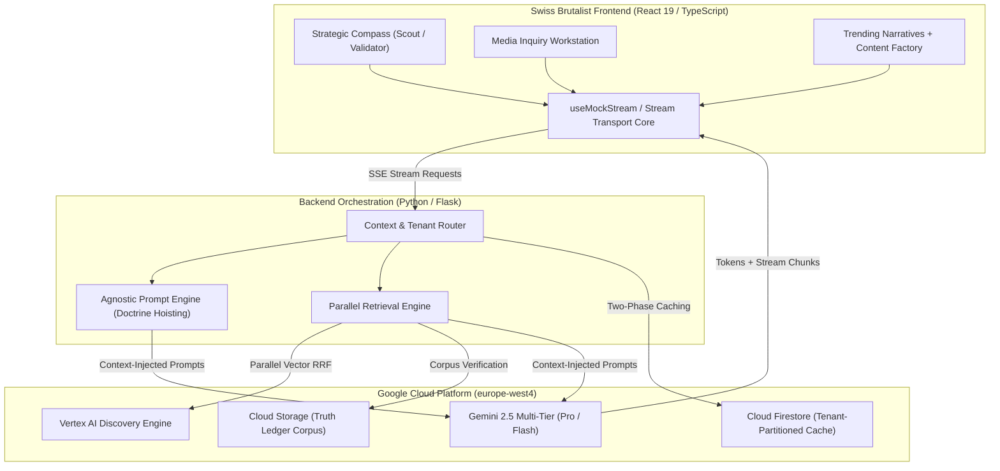

# 🇨🇭 Terrain Analytics (Architecture & Demo)

> Industrial-grade Strategic Media Intelligence & Enterprise RAG platform. Built with an adversarial Narrative Cascade engine, Media Inquiry contradiction detection, Swiss Brutalist high-density UI, and zero-trust multi-tenant isolation.

[](#-architecture-overview)
[](https://flx-xlf.github.io/strategic-analysis-app-case-study/)
[](https://react.dev/)
[](https://cloud.google.com/vertex-ai)
[](https://flx-xlf.github.io/strategic-analysis-app-case-study/)
[](LICENSE)
[](https://ko-fi.com/flxxlf)

---

## 🧭 Interactive Sandbox Demo

Explore the high-density analytical interface and intelligence simulations directly in your browser:  
👉 **[https://flx-xlf.github.io/strategic-analysis-app-case-study/](https://flx-xlf.github.io/strategic-analysis-app-case-study/)**

* **Pre-Seeded High-Stakes Scenarios (Designed for Communication Professionals):**
  * 🚄 **Gotthard-Basistunnel Kapazitätsengpass:** Red-Teaming an infrastructure policy prioritizing international freight corridors over Ticino regional passenger trains. Triggers the adversarial "Headline from Hell", regional stakeholder reactions, and a dynamic 8.7/10 Risk Index.
  * 🛡️ **Investigativ-Leak «Projekt Nimbostratus»:** High-fidelity media inquiry contradiction audit pitting leaked Azure migration plans against the official 2024 «100% Swiss Sovereign Cloud» doctrine, generating an immediate defensive statement draft.
  * 🏛️ **Ablösung des physischen Schalterverkaufs:** Countering a viral grassroots petition against the closure of 24 rural ticket desks using the Strategic Content Factory (*Hintergrund-Artikel*, *Social Media*, *Talking Points*, *Q&A Brief*).
* **100% Client-Side Simulation:** Runs fully in-browser with zero backend dependencies, deterministic LLM streaming replays, and zero cloud costs.

---

## ✨ Key Features

### 1. 🧭 Strategic Compass & Adversarial Narrative Cascade
* **Dual Operational Modes:** 
  * **Scout Mode:** Scans emergent narratives across national media to detect unaddressed thematic opportunities.
  * **Validator Mode:** Subjects planned communications to ruthless Red Team stress-testing before public release.
* **Dynamic Stakeholder Flow:** Simulates communications ripple effects:
  $$\text{Draft Message} \longrightarrow \text{Adversarial Headline} \longrightarrow \text{Stakeholder Reactions} \longrightarrow \text{Second-Order Effects} \longrightarrow \text{Risk Index (0–10)}$$
* **Contextual Dossier Evidence:** Each simulated reaction node cites grounded source articles with interactive confidence scores.

### 2. 🔍 Media Inquiry Mode & Contradiction Auditing
* **High-Fidelity Comparative Extraction:** Compares official institutional stances (*Wordings / Q&As*) directly against incoming journalist questions and investigative drafts.
* **Contradiction Detection:** Surfaces subtle discrepancies between historical press statements and current positioning before statements are issued.
* **Structured Synthesis:** Dissects arguments into structured components: *Core Thesis*, *Stated Position*, *Detected Friction Points*, and *Recommended Clarification*.

### 3. 🏭 Trending Narratives & Content Factory
* **Viral Tipping-Point Detection:** Identifies fast-moving stories across regional news outlets before they reach national saturation.
* **Meta-Communication Blueprints:** Instead of generic PR copy, the **Content Factory** generates targeted strategic blueprints:
  * **Hintergrund-Artikel:** Narrative architecture and contextual depth for investigative journalists.
  * **Social Media:** Fact-dense, neutral rebuttals tailored for rapid-response channels.
  * **Talking Points:** Framing guardrails, psychological hooks, and verbatim soundbites for spokespersons.
  * **Q&A Briefs:** Defensive answers for potential high-friction press inquiries.

### 4. 📚 Multi-Lane Enterprise RAG & Truth Ledger
* **Hybrid Retrieval Architecture:** Parallel lane retrieval orchestrating Vertex AI Discovery Engine, dense vector search (`text-embedding-004`), and sovereign relational stores.
* **Truth Ledger Fact-Checking:** Binds every LLM claim to exact line citations inside the official document corpus.
* **Resilient Ingestion Pipeline:** Cloud-native two-pass ingestion featuring post-hoc deduplication, exponential backoff, and robust rate-limit safeguarding.

### 5. 🇨🇭 Swiss Brutalist High-Density UI
* **The 1px Hairline Law:** Absolute zero `border-radius` ($0\text{px}$ across all primitives), unified 1px aluminum structural grids, and functional high-density layouts.
* **Railway Signage Typography:** Monospaced, high-tracking signage typography for telemetry badges paired with legible, tightly leaded sans-serif typography for narrative synthesis.
* **Multi-Tenant White-Label Tokens:** Brand-agnostic CSS custom properties enabling rapid tenant re-theming without sacrificing brutalist visual precision.

### 6. ⚡ Sovereign Stream Transport & Lifecycle Management
* **Unified Transport Hook:** Centralized stream orchestrator powering all analytical views with resilient error boundaries.
* **Atomic Abort Controller:** Instant cancellation of in-flight multi-step inference chains across the client and backend.
* **Zero-Trust Multi-Tenancy:** Strict tenant boundary enforcement at retrieval, prompt construction, and caching layers.

---

## 🛠️ Technology Stack

| Layer | Technology | Engineering Rationale |
|---|---|---|
| **Frontend Framework** | React 19 + TypeScript 5.9 | Concurrent rendering, strict typing across data contracts, and zero-runtime bugs |
| **Styling & Tokens** | Tailwind CSS + Vanilla CSS Tokens | Custom 1px Swiss Brutalist design system with strict token agnosticism |
| **Design Aesthetics** | Swiss Railway Signage Standard | High-density information architecture with zero border-radius and rigid hairlines |
| **AI Orchestration** | Google Vertex AI + Gemini 2.5 | Enterprise RAG in `europe-west4`, multi-tier fallback (Pro / Flash / Flash-Lite) |
| **Vector & Retrieval** | Vertex AI Search + Discovery Engine | Parallel semantic search and hybrid reciprocal rank fusion (RRF) |
| **Backend Core** | Python 3.14 + Flask / Gunicorn | High-concurrency SSE stream endpoints and Pydantic-enforced schemas |
| **Data Persistence** | Google Cloud Storage + Cloud Firestore | Tenant-partitioned document vaults and sharded response caching |

---

## 🏛️ System Architecture



---

## 🚀 Interactive Exploration

To explore the frontend interface locally without configuring Google Cloud Platform or Vertex AI credentials:

```bash
# 1. Clone the case study repository
git clone https://github.com/Flx-xlF/strategic-analysis-app-case-study.git
cd strategic-analysis-app-case-study

# 2. Install dependencies
npm install

# 3. Start development server
npm run dev

# 4. Build production bundle (<90 kB gzipped)
npm run build
```

---

## 📄 Case Study Notice & Attribution

This repository is published as a **Public Architecture Case Study & Technical Showcase**. The underlying proprietary production ingestion services, live enterprise API endpoints, and private corporate datasets remain closed source.

Built with care (and a bit of madness) by [schema/f](https://github.com/Flx-xlF).  
☕ Enjoy my work? [Tip me on Ko-fi](https://ko-fi.com/flxxlf).
